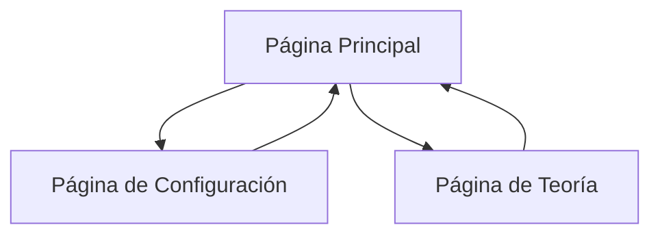

# Aplicación de la Teoría de los 21 Días - Documento de Requisitos del Producto

## 1. Descripción General del Producto
Aplicación web motivacional que ayuda a los usuarios a formar hábitos siguiendo la teoría de los 21 días, donde realizar una actividad durante 21 días consecutivos la convierte en un hábito natural.

La aplicación está dirigida a personas que buscan formar nuevos hábitos de manera estructurada y motivacional, proporcionando un sistema de seguimiento visual y recompensas configurables.

Objetivo: Facilitar la formación de hábitos mediante un seguimiento diario intuitivo y un sistema de motivación personalizable.

## 2. Funcionalidades Principales

### 2.1 Acceso a la Aplicación
La aplicación no requiere registro ni autenticación. Todos los usuarios tienen acceso completo a todas las funcionalidades desde el primer acceso, con datos almacenados localmente en el navegador.

### 2.2 Módulo de Funcionalidades
Nuestra aplicación de hábitos de 21 días consta de las siguientes páginas principales:
1. **Página Principal**: contador de días, botón de tarea completada, calendario lineal de progreso, selector de idioma.
2. **Página de Configuración**: configuración de recompensas diarias, semanales y mensuales, preferencias de idioma.
3. **Página de Teoría**: explicación detallada de la teoría de los 21 días y beneficios.

### 2.3 Soporte Multi-idioma (i18n)
La aplicación incluye soporte completo de internacionalización con:
- **Idiomas soportados**: Español (por defecto) e Inglés
- **Selector de idioma**: Disponible en todas las páginas
- **Persistencia**: El idioma seleccionado se guarda en localStorage
- **Traducción completa**: Todos los textos, mensajes y elementos de UI son traducibles
- **Cambio dinámico**: El idioma se cambia instantáneamente sin recargar la página

### 2.4 Detalles de Páginas

| Nombre de Página | Nombre del Módulo | Descripción de Funcionalidad |
|------------------|-------------------|------------------------------|
| Página Principal | Contador Principal | Mostrar días completados del ciclo actual (0-21), botón grande para marcar tarea como completada |
| Página Principal | Calendario Lineal | Visualizar progreso de 21 días con indicadores de días completados, día actual y días restantes |
| Página Principal | Estado del Hábito | Mostrar fecha de inicio, días consecutivos y motivación visual del progreso |
| Página Principal | Selector de Idioma | Dropdown para cambiar entre español e inglés con persistencia en localStorage |
| Página Configuración | Sistema de Recompensas | Configurar premios personalizados para logros diarios, semanales y mensuales |
| Página Configuración | Preferencias de Idioma | Configuración de idioma preferido con aplicación inmediata |
| Página Configuración | Gestión de Datos | Opciones para exportar/importar datos y futura integración con Discord |
| Página Teoría | Información Educativa | Explicar la teoría de los 21 días, beneficios científicos y consejos para mantener hábitos |

## 3. Proceso Principal
El usuario accede a la aplicación y ve su progreso actual. Si es la primera vez, el contador está en 0. Cada día, el usuario presiona el botón grande para marcar la tarea como completada, incrementando el contador y actualizando el calendario visual. Si el usuario no completa la tarea un día, el progreso se reinicia automáticamente al día siguiente. Al completar 7, 14 o 21 días, se muestran las recompensas configuradas. El usuario puede personalizar sus recompensas en la página de configuración y aprender sobre la teoría en la página informativa.



## 4. Diseño de Interfaz de Usuario
### 4.1 Estilo de Diseño
- Colores primarios: Verde (#10B981) para éxito y progreso, Azul (#3B82F6) para elementos interactivos
- Colores secundarios: Gris claro (#F3F4F6) para fondos, Rojo suave (#EF4444) para reinicio/advertencias
- Estilo de botones: Redondeados con sombras suaves, botón principal grande y prominente
- Fuentes: Inter o system fonts, tamaños 16px para texto base, 24px para títulos, 48px para contador
- Estilo de layout: Diseño centrado tipo tarjeta, navegación superior simple
- Iconos: Estilo minimalista con emojis para recompensas y checkmarks para progreso

### 4.2 Resumen de Diseño de Páginas

| Nombre de Página | Nombre del Módulo | Elementos de UI |
|------------------|-------------------|----------------|
| Página Principal | Contador Principal | Número grande centrado (0-21), botón circular verde grande "¡Tarea Completada!", animaciones de celebración |
| Página Principal | Calendario Lineal | Línea horizontal con 21 círculos, círculos verdes para días completados, círculo actual destacado, días futuros en gris |
| Página Principal | Estado del Hábito | Tarjeta con fecha de inicio, días consecutivos, mensaje motivacional dinámico |
| Página Configuración | Sistema de Recompensas | Formularios para configurar texto de recompensas, campos para premios diarios/semanales/mensuales |
| Página Teoría | Información Educativa | Texto estructurado con títulos, párrafos explicativos, estadísticas visuales, diseño tipo artículo |

### 4.3 Responsividad
La aplicación es mobile-first con adaptación completa para desktop, optimizada para interacción táctil en dispositivos móviles con botones grandes y navegación intuitiva.

## 5. Especificaciones Técnicas
### 5.1 Dependencias Mínimas
- **Frontend**: React 18+ con TypeScript para type safety
- **Estilos**: Tailwind CSS para diseño responsive y consistente
- **Internacionalización**: react-i18next (única dependencia externa esencial para i18n)
- **Principio**: Priorizar APIs nativas del navegador sobre librerías externas

### 5.2 APIs Nativas y Implementación
- **Almacenamiento**: localStorage nativo sin librerías adicionales
- **Peticiones HTTP**: fetch API nativo (no axios) para futuras integraciones
- **Gestión de Estado**: React hooks nativos (useState, useEffect, custom hooks propios)
- **Animaciones**: CSS/Tailwind transitions en lugar de librerías de animación
- **Componentes UI**: Componentes propios sin librerías de UI components

### 5.3 Estructura y Código
- **Arquitectura**: Componentes modulares y reutilizables siguiendo principios de clean code
- **Comentarios**: Todos los comentarios en el código deben estar en inglés
- **Archivos de traducción**: Estructura JSON para español (es.json) e inglés (en.json)
- **Hooks personalizados**: useLocalStorage, useHabitTracker implementados con React nativo
- **Futuras integraciones**: API preparada con fetch nativo para conexión con Discord y otras plataformas

### 5.1 Estructura de Archivos i18n
```
src/
├── locales/
│   ├── es.json (español - idioma por defecto)
│   └── en.json (inglés)
├── hooks/
│   └── useTranslation.ts (hook personalizado para traducciones)
└── components/
    └── LanguageSelector.tsx (selector de idioma)
```